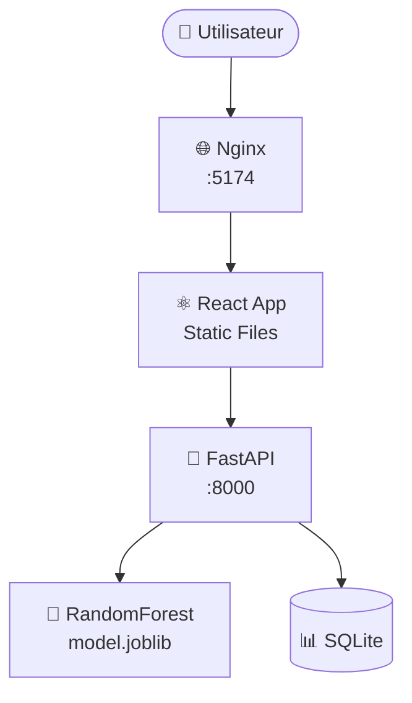

# 🐳 Docker et Docker Compose pour MLOps

[](https://www.python.org/)
[](https://fastapi.tiangolo.com/)
[](https://reactjs.org/)
[](https://www.docker.com/)
[](https://nginx.org/)

## 📋 Vue d'Ensemble

Application complète de prédiction basée sur le dataset Iris utilisant un modèle **RandomForest**. Ce projet démontre la **conteneurisation** et le **déploiement** d'une application ML full-stack avec Docker et Docker Compose.

### 🎯 Objectifs du Projet

- Conteneuriser une API ML avec Docker
- Créer un frontend React avec build multi-stage
- Orchestrer les services avec Docker Compose
- Implémenter les bonnes pratiques de déploiement MLOps

### ✨ Fonctionnalités Clés

- **🐍 API FastAPI** : Backend pour les prédictions ML
- **⚛️ Frontend React** : Interface utilisateur moderne avec Vite
- **🐳 Docker Multi-stage** : Images optimisées et légères
- **🔄 Docker Compose** : Orchestration multi-services
- **📊 Monitoring** : Support Prometheus/Grafana (optionnel)

---

## 🏗️ Architecture du Projet



### Structure des Fichiers

```
iris-ai-service/
├── api/
│   ├── Dockerfile              # Image Python pour l'API
│   ├── requirements.txt        # Dépendances Python
│   └── app/
│       ├── main.py            # Point d'entrée FastAPI
│       ├── models.py          # Modèles Pydantic
│       ├── db.py              # Gestion base de données
│       └── model/
│           ├── model.joblib   # Modèle ML entraîné
│           └── model_metadata.json
├── frontend/
│   ├── Dockerfile             # Multi-stage: Node + Nginx
│   ├── package.json
│   ├── nginx.conf            # Configuration Nginx
│   └── src/
│       ├── App.jsx
│       └── main.jsx
├── monitoring/               # Prometheus/Grafana (optionnel)
├── docker-compose.yml        # Orchestration des services
└── README.md
```

---

## 🚀 Installation et Déploiement

### Prérequis

- **Docker Desktop** (Windows/Mac) ou **Docker Engine** (Linux)
- **Docker Compose** v2.0+
- **Git**
- Ports **8000** et **5174** disponibles
- Au moins **2 GB de RAM**

### Étape 1 : Cloner le Projet

```bash
git clone https://github.com/chaima-massaoudi/Docker-et-Docker-Compose-pour-MLOps.git
cd iris-ai-service
```

### Étape 2 : Construction et Lancement

```bash
# Construire et lancer tous les services
docker compose up --build

# OU en mode détaché (arrière-plan)
docker compose up --build -d
```

**Temps estimé :** 3-5 minutes (première fois)

### Étape 3 : Vérification du Déploiement

```bash
docker compose ps
```

**Résultat attendu :**
```
NAME            STATE    PORTS
iris-api        Up       0.0.0.0:8000->8000/tcp
iris-frontend   Up       0.0.0.0:5174->80/tcp
```

### Étape 4 : Tester l'Application

- 📚 **API Documentation (Swagger)** : http://localhost:8000/docs
- ❤️ **API Health Check** : http://localhost:8000/health
- 🌐 **Frontend** : http://localhost:5174

---

## 🐳 Détails des Dockerfiles

### API Dockerfile (Python)

```dockerfile
FROM python:3.11-slim
WORKDIR /app
COPY requirements.txt .
RUN pip install --no-cache-dir -r requirements.txt
COPY app/ ./app/
EXPOSE 8000
CMD ["uvicorn", "app.main:app", "--host", "0.0.0.0", "--port", "8000"]
```

**Caractéristiques :**
- 🐍 Base légère : `python:3.11-slim` (~150 MB)
- 📦 Installation optimisée avec `--no-cache-dir`
- 🚀 Serveur ASGI Uvicorn pour hautes performances

### Frontend Dockerfile (Multi-stage)

```dockerfile
# Build stage
FROM node:20-alpine AS builder
WORKDIR /app
COPY package*.json ./
RUN npm install
COPY . .
RUN npm run build

# Production stage
FROM nginx:alpine
COPY --from=builder /app/dist /usr/share/nginx/html
COPY nginx.conf /etc/nginx/conf.d/default.conf
EXPOSE 80
CMD ["nginx", "-g", "daemon off;"]
```

**Avantages du Multi-stage Build :**
- ⚡ Image finale ultra-légère (~25 MB vs ~300 MB)
- 🔨 Séparation build/runtime
- 🚀 Nginx performant pour fichiers statiques

---

## 🌐 API Endpoints

### Health Check

```http
GET /health
```

**Réponse :**
```json
{
  "status": "ok",
  "model_loaded": true,
  "model_type": "RandomForestClassifier",
  "features": ["sepal_length", "sepal_width", "petal_length", "petal_width"]
}
```

### Prédiction

```http
POST /predict
Content-Type: application/json

{
  "sepal_length": 5.1,
  "sepal_width": 3.5,
  "petal_length": 1.4,
  "petal_width": 0.2
}
```

**Réponse :**
```json
{
  "prediction": "setosa",
  "probabilities": {
    "setosa": 0.95,
    "versicolor": 0.03,
    "virginica": 0.02
  }
}
```

---

## 🔧 Commandes Docker Essentielles

### Gestion des Services

```bash
# Démarrer tous les services
docker compose up -d

# Arrêter tous les services
docker compose down

# Redémarrer un service
docker compose restart api

# Reconstruire sans cache
docker compose build --no-cache

# Voir l'état des conteneurs
docker compose ps
```

### Logs et Debugging

```bash
# Voir les logs de tous les services
docker compose logs -f

# Voir les logs d'un service spécifique
docker compose logs -f api

# Accéder au shell du conteneur API
docker compose exec api /bin/bash

# Voir les ressources utilisées
docker stats
```

### Nettoyage

```bash
# Arrêter et supprimer les conteneurs
docker compose down

# Supprimer aussi les volumes
docker compose down -v

# Nettoyage complet du système Docker
docker system prune -a --volumes
```

---

## 🔒 Variables d'Environnement

| Variable | Service | Description | Valeur par Défaut |
|----------|---------|-------------|-------------------|
| `API_PORT` | API | Port d'écoute de l'API | 8000 |
| `CORS_ORIGINS` | API | Origines CORS autorisées | http://localhost:5174 |
| `VITE_API_BASE` | Frontend | URL de base de l'API | http://localhost:8000 |

---

## 🐛 Troubleshooting

### Port déjà utilisé

```powershell
# Windows - Trouver le processus
netstat -ano | findstr :8000

# Tuer le processus (remplacer PID)
taskkill /PID <PID> /F
```

### Erreur CORS

1. Vérifier que `VITE_API_BASE` est correct
2. Vérifier que `CORS_ORIGINS` inclut l'URL du frontend
3. Rebuild le frontend : `docker compose up --build frontend`

### Modèle non trouvé

```bash
# Vérifier que le modèle existe
ls api/app/model/

# Reconstruire l'image
docker compose build api
```

---

## 📊 Monitoring (Optionnel)

Configuration Prometheus/Grafana disponible dans `monitoring/` :

- **Prometheus** : http://localhost:9090
- **Grafana** : http://localhost:3000 (admin/admin)

---

## 📚 Ressources

- [Documentation FastAPI](https://fastapi.tiangolo.com/)
- [Documentation Docker](https://docs.docker.com/)
- [Documentation Docker Compose](https://docs.docker.com/compose/)
- [React + Vite](https://vitejs.dev/)
- [Docker Multi-stage Builds](https://docs.docker.com/build/building/multi-stage/)

---

**Bon déploiement ! 🐳**
